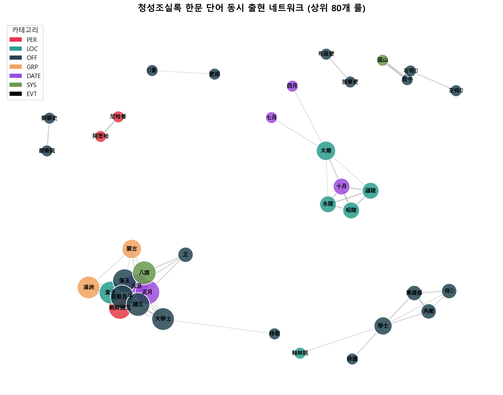
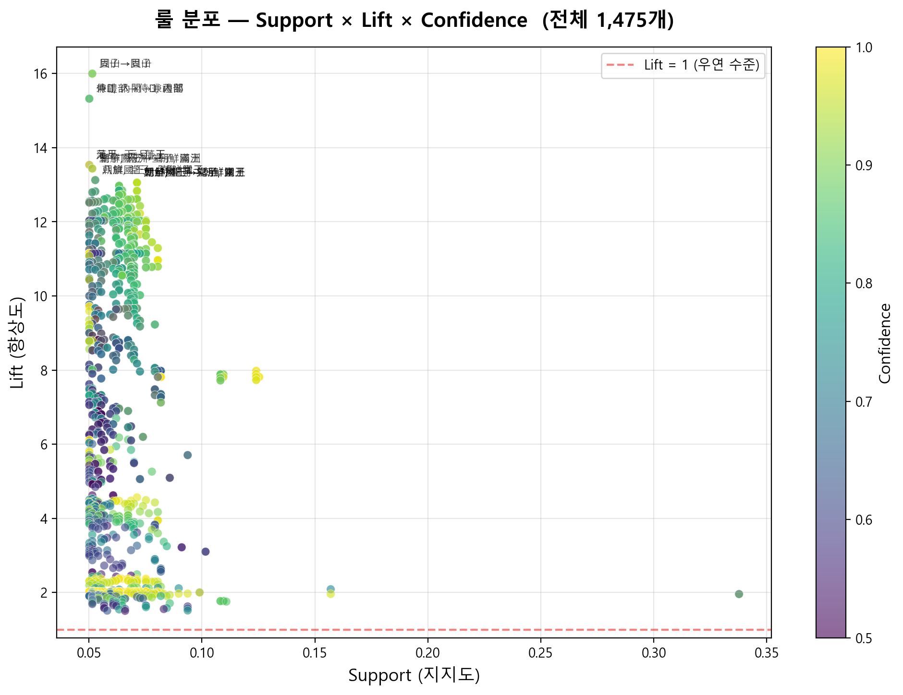
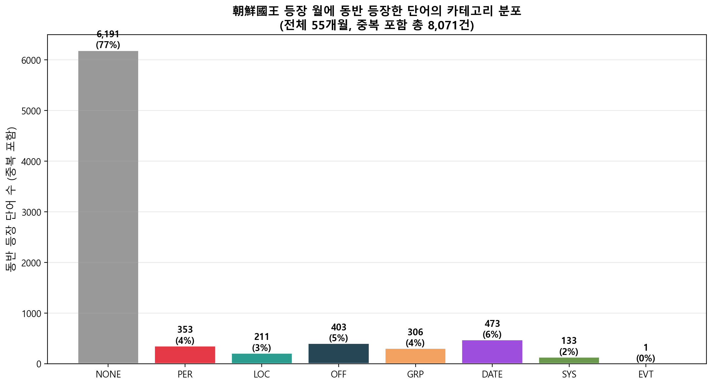
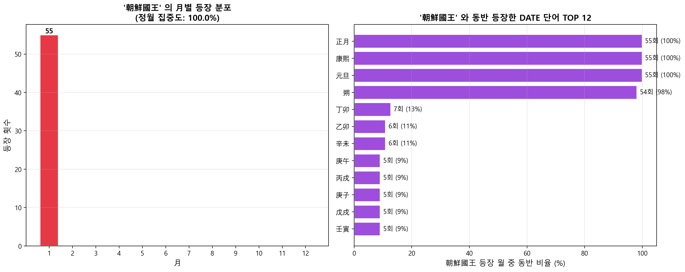
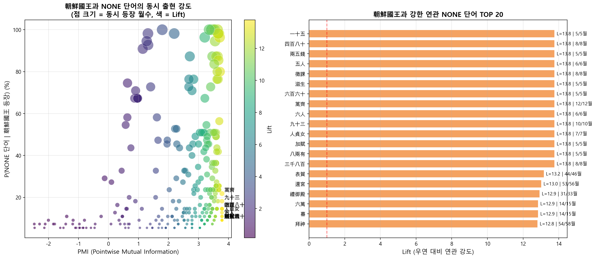
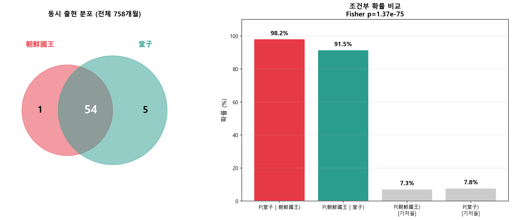
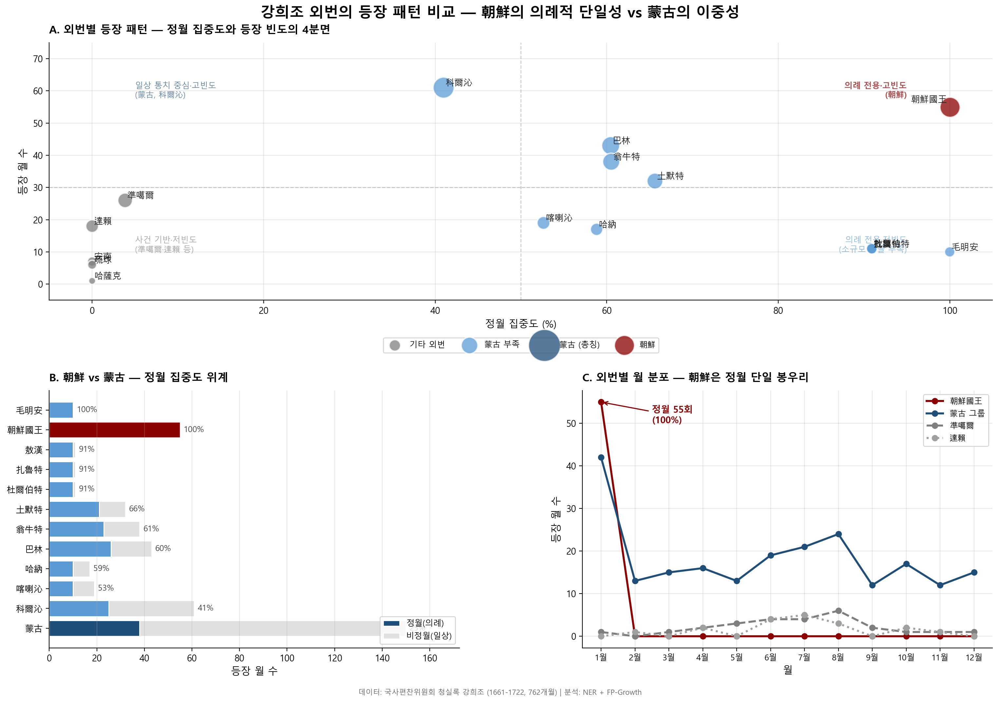

# A Study on the Hierarchical Structure of Outer Vassals (外藩) during the Kangxi Reign
### A Comparative Analysis of Joseon, Mongol, and Other Outer Vassals through Text Mining of the *Veritable Records of the Qing* (清實錄)

> **Sister project of [The-vertiable-records-of-Kangxi-predictor](https://github.com/a26532198-collab/The-vertiable-records-of-Kangxi-predictor).**
> Both projects analyze the same Kangxi-era *Qing Shilu* corpus (1661–1722). The sister project performs **supervised crisis prediction** (Logistic Regression / Lasso); this project performs **unsupervised pattern discovery** (FP-Growth association-rule mining).

This project applies an NER + FP-Growth association-rule pipeline to the main annals of the Kangxi reign (1661–1722) in the *Qing Shilu* (清實錄). It demonstrates quantitatively that the **King of Joseon (朝鮮國王)** appears as a deterministic central node in the New Year (正月) ritual cluster, and that the Qing outer vassals (外藩) are differentiated into a **three-tier hierarchy**: (i) ritual-only, (ii) dual ritual–administrative, and (iii) event-based.

---

## 1. Key Findings (TL;DR)

- Scope: 758 regular months (1661.01–1722.12, excluding 23 intercalary months), 4,922 non-NONE tokens, 1,475 association rules.
- The **King of Joseon** appears in 55 months, and **all 55** fall in the first lunar month (正月): 55/55 = 100%, confidence = 1.00, lift = 13.44.
- Co-occurrence with the core New Year ritual term 堂子 (Tangzi, the Qing imperial sacrificial site): P(堂子 | 朝鮮國王) = 98.2% (54/55), P(朝鮮國王 | 堂子) = 91.5% (54/59).
- Fisher exact test p = 1.37 × 10⁻⁷⁵ — chance occurrence is effectively zero.
- The 7 regular months in which the King of Joseon does *not* appear all coincide with major political crises of the Kangxi reign (Revolt of the Three Feudatories, the Galdan campaigns, the first and second depositions of the Crown Prince, etc.).
- Three-tier structure of outer vassals:
  - **Tier 1 (ritual-only):** 朝鮮國王, 毛明安, 杜爾伯特, 敖漢, 扎魯特.
  - **Tier 2 (dual: ritual + governance):** 科爾沁, 蒙古 (general), 土默特, 翁牛特, 巴林, 喀喇沁.
  - **Tier 3 (event-based):** 準噶爾, 達賴, 安南, 琉球, 哈薩克 — all below the 5% support threshold.



---

## 2. Background

The Qing system of outer vassals (外藩) was not a single, undifferentiated category of "tributary states." Vassals were stratified along ritual and legal distance from the imperial house. Earlier historiography — most notably Gu Beom-jin's work — has argued through close reading that Joseon's relation to the Qing was bound primarily through ritual. However, **large-scale, quantitative verification at the text level** has been rare. This project processes 62 years of Kangxi-period main annals through a machine-learning pipeline to corroborate and extend such historiographic interpretations.

A complementary, supervised line of inquiry on the same corpus is pursued in the sister project [The-vertiable-records-of-Kangxi-predictor](https://github.com/a26532198-collab/The-vertiable-records-of-Kangxi-predictor), which asks whether yearly word-frequency vectors can predict crisis years. The two projects together pair *unsupervised pattern discovery* with *supervised prediction* on identical source data.

---

## 3. Data

- Source: Main annals of the Kangxi reign in the *Qing Shilu* (1661.01–1722.12), via the [National Institute of Korean History database](http://db.history.go.kr/).
- Files: 759 monthly CSVs (758 regular + 23 intercalary). Only the 758 regular months are used for analysis.
- Naming convention: `YYYY_MM.csv` (regular months), `YYYY_yunMM.csv` (intercalary months).
- Each row: a Han-character token paired with its frequency.
- Directory: `1661 - 1722/`.

After preprocessing the files are merged into `csv/merged.csv`. About 70 single-character function words (之, 也, 以, 於, 為, …) are removed.

---

## 4. Pipeline

```
Raw CSVs (759)
   │
   ▼ [Cell 2] Merge + remove 1-char function words
csv/merged.csv
   │
   ▼ [Cell 5] NER via DeepSeek API (7+1 categories)
csv/ner_results.csv  (21,126 rows after dropping NONE)
   │
   ▼ [Cell 6] Build month-level transactions
csv/transactions_month.csv  (758 months, mean 27.9 items)
   │
   ▼ [Cell 7] FP-Growth (mlxtend)
csv/rules_month.csv  (1,475 rules)
   │
   ▼ [Cell 8] Keyword / category queries + statistical tests
csv/rules_朝鮮.csv, rules_蒙古.csv, rules_準噶爾.csv, rules_達賴.csv, …
```

NER categories (7 + 1): **PER** (persons / royal titles), **LOC** (places), **OFF** (offices and ranks), **GRP** (tribes / groups), **DATE** (dates / regnal terms), **SYS** (institutions / legal categories), **EVT** (events), **NONE** (excluded).



FP-Growth parameters: `min_support = 0.05` (≥ 38 months), `min_confidence = 0.5`, `min_lift = 1.5`, `max_len = 3`. EVT tokens fail to enter any rule because each appears in at most 19 months, well below the 5% support threshold.

---

## 5. Main Results

### 5.1 Deterministic coupling between the King of Joseon and the New Year ritual

The King of Joseon appears in 55 months across the 62-year span, and **every one of those 55 months is in the first lunar month**. The co-occurrence with 堂子, the central New Year ritual term, is summarized below.



| Measure | Value |
|---|---|
| P(堂子 \| 朝鮮國王) | 54/55 = 98.2% |
| P(朝鮮國王 \| 堂子) | 54/59 = 91.5% |
| Lift | 13.44 |
| Fisher exact p | 1.37 × 10⁻⁷⁵ |

### 5.2 The 7 absent years and their alignment with political crises

The 7 first-lunar months in which the King of Joseon does not appear all overlap with major political crises of the Kangxi reign (Revolt of the Three Feudatories, the Galdan campaigns, the first and second depositions of the Crown Prince, etc.). This is also independently corroborated by the sister project's supervised crisis-prediction model, which surfaces an overlapping set of crisis-signaling terms.




### 5.3 The three-tier hierarchy of outer vassals

Outer-vassal terms are classified along two axes — coupling with the New Year ritual cluster and coupling with everyday-governance vocabulary — yielding three tiers.



- **Tier 1 (ritual-only):** 朝鮮國王, 毛明安, 杜爾伯特, 敖漢, 扎魯特 — detected only in the first lunar month.
- **Tier 2 (dual):** 科爾沁 (41% in 正月), 蒙古 general (38/150 = 25.3%), 土默特, 翁牛特, 巴林, 喀喇沁 — detected in both ritual and non-ritual months, coupled with terms such as 諸王, 貝勒貝子, 大學士.
- **Tier 3 (event-based):** 準噶爾, 達賴, 安南, 琉球, 哈薩克 — below the 5% support threshold; appear in the records only as discrete events.



---

## 6. Reproduction

### 6.1 Environment

- Python 3.12.8
- pandas, numpy, scipy, scikit-learn, matplotlib
- mlxtend 0.24.0 (FP-Growth)
- openai (DeepSeek API client)
- VSCode + Jupyter

### 6.2 Steps

```bash
# 1. Clone the repository
git clone https://github.com/a26532198-collab/Kangxi-MBA-Association-Rule-Mining.git
cd Kangxi-MBA-Association-Rule-Mining

# 2. Set the DeepSeek API key (only needed if you re-run the NER stage)
#    Save it in a .env file as DEEPSEEK_API_KEY=...

# 3. Open the notebook
jupyter notebook jpt/NERQING.ipynb
```

The NER output (`csv/ner_results.csv`) and the transaction file (`csv/transactions_month.csv`) are included in the repository, so **the 1,475 rules can be reproduced from Cell 6 onward without any DeepSeek API key**.

### 6.3 Determinism

- DeepSeek NER: `temperature = 0` makes the calls effectively deterministic, but minor API-side variation is still possible. Using the bundled `ner_results.csv` guarantees identical downstream results.
- FP-Growth: the algorithm itself is deterministic, so the same input produces the same 1,475 rules.

---

## 7. Repository structure

```
Kangxi-MBA-Association-Rule-Mining/
├── 1661 - 1722/              # 759 raw monthly CSVs
├── csv/                      # intermediate and final outputs
│   ├── merged.csv
│   ├── ner_results.csv       # NONE removed; used for analysis
│   ├── ner_results_all.csv   # full output including NONE
│   ├── transactions_month.csv
│   ├── transactions_year.csv
│   ├── rules_month.csv       # final 1,475 rules
│   ├── rules_朝鮮.csv
│   ├── rules_蒙古.csv
│   ├── rules_準噶爾.csv
│   ├── rules_達賴.csv
│   ├── joseon_crisis_overlap.csv
│   ├── joseon_missing_years.csv
│   ├── joseon_none_cooccurrence.csv
│   ├── joseon_rules_for_review.csv
│   └── korea_related_words.csv
├── figure/                   # 11 figures used in the paper
├── jpt/
│   └── NERQING.ipynb         # full pipeline notebook
├── 문서/                      # paper draft (docx)
├── LICENSE
└── README.md
```

---

## 8. Limitations

- The analysis is restricted to the main annals of the Kangxi reign in the *Qing Shilu*. Core ritual and diplomatic sources — *Da Qing Huidian* (大清會典), *Qinding Da Qing Tongli* (欽定大清通禮), *Lifanyuan Zeli* (理藩院則例), *Tongmun Hwigo* (同文彙考), *Tongmun'gwanji* (通文館志), *Seungjeongwon Ilgi* (承政院日記), and *Bibyeonsa Deungrok* (備邊司謄錄) — are not included. The claim that "the King of Joseon is the central node of the New Year ritual" therefore holds, strictly, at the textual level: it is a statement about how the compilers of the *Qing Shilu* chose to record events.
- NER relies on a single pass of one model (DeepSeek), without quantitative precision/recall validation. Polysemous tokens such as 蒙古 are pinned to a single category (GRP), and synonym/variant merging is not performed.
- EVT-category tokens fall below the 5% support threshold and so do not enter any rule; the three-tier analysis relies on frequency-based supplementary evidence at this level.

---

## 9. Related Work (Sister Project)

A complementary supervised analysis on the same Kangxi-era *Qing Shilu* corpus — yearly word-frequency features fed into Logistic Regression and Lasso classifiers, evaluated under Leave-One-Out and nested LOO cross-validation for crisis-year prediction — is maintained in a separate repository:

> **[The-vertiable-records-of-Kangxi-predictor](https://github.com/a26532198-collab/The-vertiable-records-of-Kangxi-predictor)**
> *"Crisis Prediction from the Veritable Records of Kangxi: A Word Frequency Analysis."*

The two projects share the same source corpus (759 monthly CSVs scraped from the National Institute of Korean History) but address orthogonal questions:

| | **This project** | **Sister project** |
|---|---|---|
| Question | Which classical Chinese terms co-occur within a month, and what hierarchical structure do they reveal? | Can yearly word-frequency vectors predict crisis years? |
| Paradigm | Unsupervised pattern discovery | Supervised classification |
| Unit | Month (758 transactions) | Year (62 samples) |
| Method | NER + FP-Growth association rules | Logistic Regression / Lasso, LOO-CV, nested LOO-CV |
| Primary output | 1,475 association rules; three-tier outer-vassal hierarchy | Top-50 crisis-signaling keywords; AUC-ROC = 0.989 (LOO), 0.693 (nested) |

The sister project independently identifies a Kangxi-period crisis vocabulary (民情, 達賴, 殺, 還宮, …) whose temporal distribution is consistent with the 7 absent-year results in §5.2 of this project. The two analyses thus cross-validate one another from opposite methodological directions.

---

## 10. Citation

```
Kim, Hyungmin (2026). A Study on the Hierarchical Structure of Outer Vassals (外藩)
during the Kangxi Reign: A Comparative Analysis of Joseon, Mongol, and Other Outer
Vassals through Text Mining of the Veritable Records of the Qing.
https://github.com/a26532198-collab/Kangxi-MBA-Association-Rule-Mining
```

```bibtex
@misc{kim2026kangxiOuterVassals,
  author = {Kim, Hyungmin},
  title  = {A Study on the Hierarchical Structure of Outer Vassals during the Kangxi Reign:
            A Comparative Analysis of Joseon, Mongol, and Other Outer Vassals
            through Text Mining of the Veritable Records of the Qing},
  year   = {2026},
  url    = {https://github.com/a26532198-collab/Kangxi-MBA-Association-Rule-Mining}
}
```

---

## 11. License

- **Code:** [MIT License](LICENSE)
- **Data:** Raw text is sourced from the [National Institute of Korean History](http://db.history.go.kr/) and is not redistributed here under the source's licensing terms.
- **Analysis content (figures, tables, written analysis):** [CC BY-NC-SA 4.0](https://creativecommons.org/licenses/by-nc-sa/4.0/)

**Thank you for reading.**
